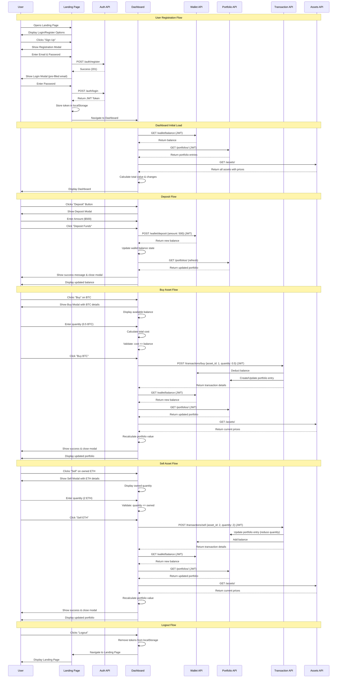

```mermaid
sequenceDiagram
    participant U as User
    participant LP as Landing Page
    participant Auth as Auth API
    participant D as Dashboard
    participant W as Wallet API
    participant P as Portfolio API
    participant T as Transaction API
    participant A as Assets API

    Note over U,A: User Registration Flow
    U->>LP: Opens Landing Page
    LP->>U: Display Login/Register Options
    U->>LP: Clicks "Sign Up"
    LP->>U: Show Registration Modal
    U->>LP: Enter Email & Password
    LP->>Auth: POST /auth/register
    Auth-->>LP: Success (201)
    LP->>U: Show Login Modal (pre-filled email)
    U->>LP: Enter Password
    LP->>Auth: POST /auth/login
    Auth-->>LP: Return JWT Token
    LP->>LP: Store token in localStorage
    LP->>D: Navigate to Dashboard

    Note over U,A: Dashboard Initial Load
    D->>W: GET /wallet/balance (JWT)
    W-->>D: Return balance
    D->>P: GET /portfolios/ (JWT)
    P-->>D: Return portfolio entries
    D->>A: GET /assets/
    A-->>D: Return all assets with prices
    D->>D: Calculate total value & changes
    D->>U: Display Dashboard

    Note over U,A: Deposit Flow
    U->>D: Clicks "Deposit" Button
    D->>U: Show Deposit Modal
    U->>D: Enter Amount ($500)
    U->>D: Click "Deposit Funds"
    D->>W: POST /wallet/deposit {amount: 500} (JWT)
    W-->>D: Return new balance
    D->>D: Update wallet balance state
    D->>P: GET /portfolios/ (refresh)
    P-->>D: Return updated portfolio
    D->>U: Show success message & close modal
    D->>U: Display updated balance

    Note over U,A: Buy Asset Flow
    U->>D: Clicks "Buy" on BTC
    D->>U: Show Buy Modal with BTC details
    D->>D: Display available balance
    U->>D: Enter quantity (0.5 BTC)
    D->>D: Calculate total cost
    D->>D: Validate: cost <= balance
    U->>D: Click "Buy BTC"
    D->>T: POST /transactions/buy {asset_id: 1, quantity: 0.5} (JWT)
    T->>W: Deduct balance
    T->>P: Create/Update portfolio entry
    T-->>D: Return transaction details
    D->>W: GET /wallet/balance (JWT)
    W-->>D: Return new balance
    D->>P: GET /portfolios/ (JWT)
    P-->>D: Return updated portfolio
    D->>A: GET /assets/
    A-->>D: Return current prices
    D->>D: Recalculate portfolio value
    D->>U: Show success & close modal
    D->>U: Display updated portfolio

    Note over U,A: Sell Asset Flow
    U->>D: Clicks "Sell" on owned ETH
    D->>U: Show Sell Modal with ETH details
    D->>D: Display owned quantity
    U->>D: Enter quantity (2 ETH)
    D->>D: Validate: quantity <= owned
    U->>D: Click "Sell ETH"
    D->>T: POST /transactions/sell {asset_id: 2, quantity: 2} (JWT)
    T->>P: Update portfolio entry (reduce quantity)
    T->>W: Add balance
    T-->>D: Return transaction details
    D->>W: GET /wallet/balance (JWT)
    W-->>D: Return new balance
    D->>P: GET /portfolios/ (JWT)
    P-->>D: Return updated portfolio
    D->>A: GET /assets/
    A-->>D: Return current prices
    D->>D: Recalculate portfolio value
    D->>U: Show success & close modal
    D->>U: Display updated portfolio

    Note over U,A: Logout Flow
    U->>D: Clicks "Logout"
    D->>D: Remove tokens from localStorage
    D->>LP: Navigate to Landing Page
    LP->>U: Display Landing Page
```